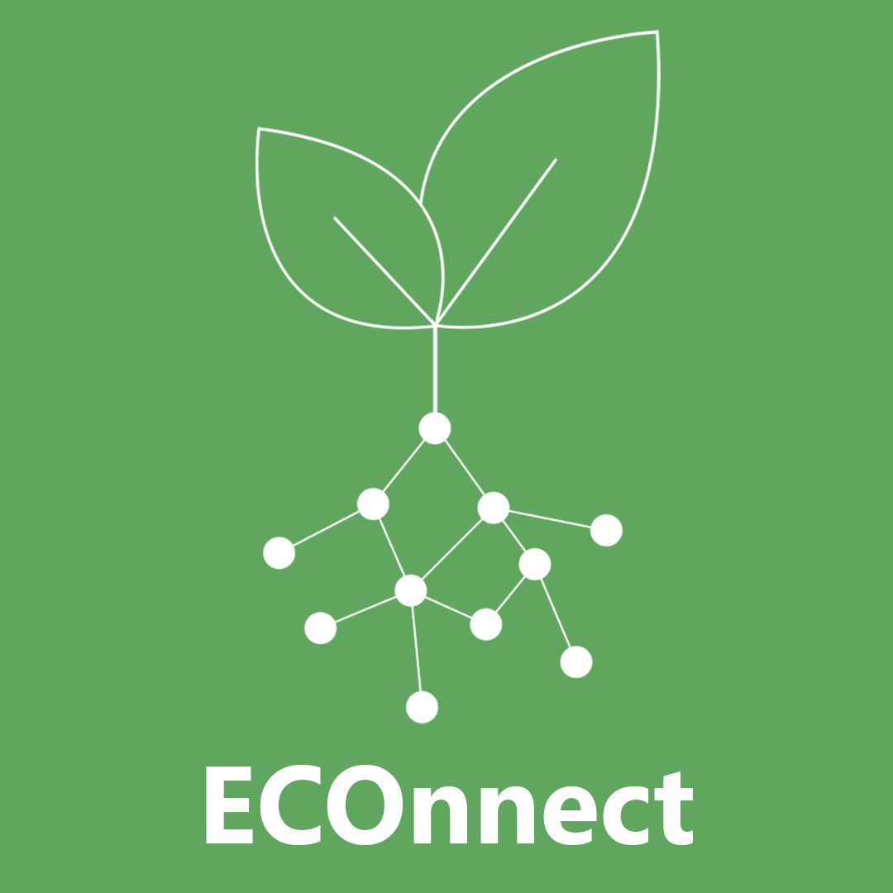
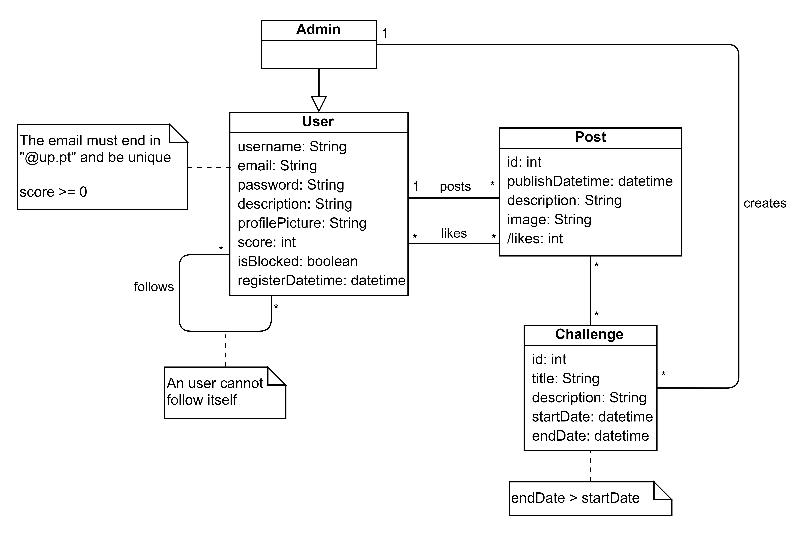
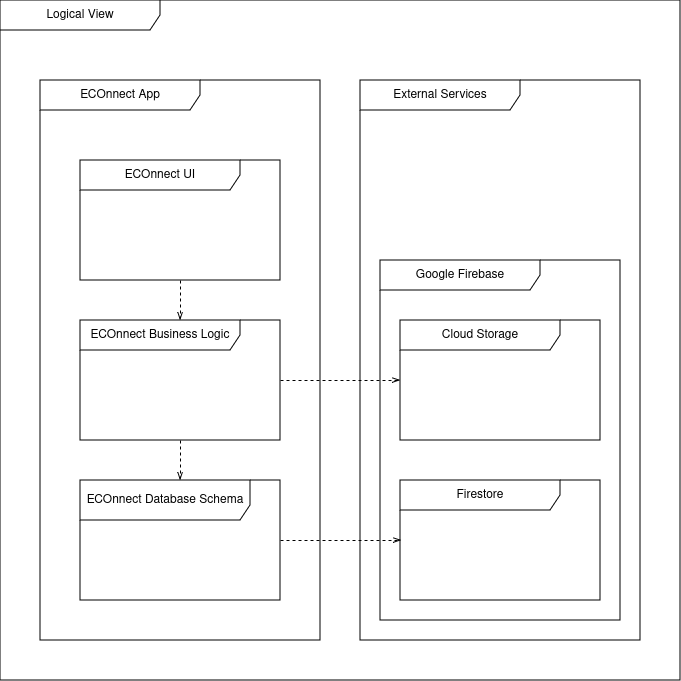
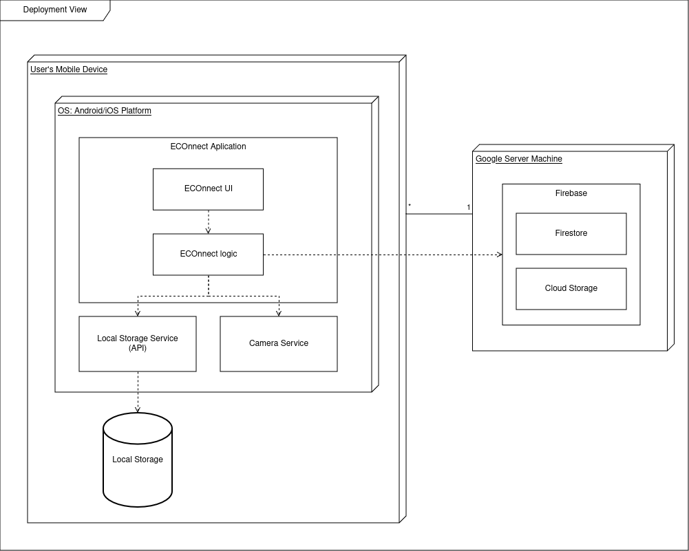
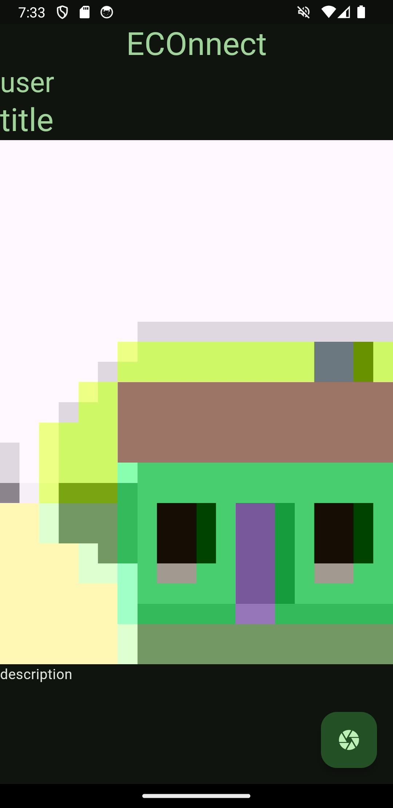

<h1 align="center"> ECOnnect Development Report </h1>

<b>Welcome to the documentation pages of ECOnnect!</b>

You can find here details about **ECOnnect**, from a high-level vision to low-level implementation decisions, a kind of **Software Development Report**, organized by type of activities: 

- [Business Modelling](#business-modelling)
  - [Product Vision](#product-vision)
  - [Features, Assumptions and Dependencies](#features-assumptions-and-dependencies)
    - [Features](#features)
    - [Assumptions and Dependencies](#assumptions-and-dependencies)
- [Requirements](#requirements)
  - [User Stories](https://github.com/FEUP-LEIC-ES-2023-24/2LEIC16T1/issues?q=is%3Aissue+label%3A%22user+story%22)
  - [Domain model](#domain-model)
- [Architecture and Design](#architecture-and-design)
  - [Logical architecture](#logical-architecture)
  - [Physical architecture](#physical-architecture)
  - [Vertical prototype](#vertical-prototype)
- [Project management](#project-management)

Contributions are expected to be made exclusively by the initial team, but we may open them to the community, after the course, in all areas and topics: requirements, technologies, development, experimentation, testing, etc.

Please contact us!  
Thank you!

- [Bruno Oliveira](https://github.com/Process-ing) (up202208700@up.pt)
- [João Mendes](https://github.com/The-Memechanic) (up202208783@up.pt)
- [Nuno Machado](https://github.com/Slyfenon) (up202206186@up.pt)
- [Rodrigo Silva](https://github.com/racoelhosilva) (up202205188@up.pt)
- [Vítor Pires](https://github.com/vitormpp) (up202207301@up.pt)
> 2LEIC16T1 - ES 2023/24

---

## Business Modelling

### Product Vision

<!--- Start by defining a clear and concise vision for your app, to help members of the team, contributors, and users to focus their often disparate views into a concise, visual, and short textual form. It provides a "high concept" of the product for marketers, developers, and managers.

A product vision describes the essentials of the product and sets the direction for where a product is headed, and what the product will deliver in the future. 

**We favor a catchy and concise statement, ideally one sentence.**

We suggest you use the product vision template described in the following link:
* [How To Create A Convincing Product Vision To Guide Your Team, by uxstudioteam.com](https://uxstudioteam.com/ux-blog/product-vision/)

To learn more about how to write a good product vision, please see also:
* [Product Management: Product Vision, by ProductPlan](https://www.productplan.com/glossary/product-vision/)
* [Vision, by scrumbook.org](http://scrumbook.org/value-stream/vision.html)
* [How to write a vision, by dummies.com](https://www.dummies.com/business/marketing/branding/how-to-write-vision-and-mission-statements-for-your-brand/)
* [20 Inspiring Vision Statement Examples (2019 Updated), by lifehack.org](https://www.lifehack.org/articles/work/20-sample-vision-statement-for-the-new-startup.html)
-->

<h4 align="center"> Small actions, big impact: stay connected for a sustainable tomorrow!</h4>

In an era facing serious environmental issues, everyone needs to take action toward a brighter future, but how exactly?  
ECOnnect addresses this question by embracing community and collaboration, and encouraging academic members to promote and share eco-friendly actions and ideas.  
Together, we can achieve meaningful results with simple everyday contributions. Come help us!

### Features, Assumptions and Dependencies

<!---
Indicate an initial/tentative list of high-level features - high-level capabilities or desired services of the system that are necessary to deliver benefits to the users.
 - Feature XPTO - a few words to briefly describe the feature
 - Feature ABCD - ...
...

Optionally, indicate an initial/tentative list of assumptions that you are making about the app and the dependencies of the app to other systems.
-->

#### Features

- **Student Login**: Students who want to use the app should be able to create an account through their academic e-mail
- **Share Content**: Users will be able to upload pictures/videos to the app, or even take them through the camera, and share them with the community.
- **Profile Page**: Users will be able to see information about other users on their respective profile pages, like profile pictures, contact information and previous posts.
- **Follow Other Users**: Logged-in users will be able to follow other users, allowing them to be updated on their activity and prioritize their posts on the follower's feed.
- **User Feed**: Users will see the most relevant posts on the first page
- **Sustainability Challenges**: Monthly challenges or initiatives related to sustainability will be available, to engage users in eco-friendly activities.
- **Rating System**: Users who find other posts inspiring can give positive feedback to the original creator, allowing them to rank higher in challenges and be suggested to other people.
- **Search Users**: Users should be able to search for other users, according to their interests.

#### Assumptions and Dependencies

- Firebase (Firestore and Cloud Storage)
- Flutter [image_picker plugin](https://pub.dev/packages/image_picker)

<!---
### Elevator Pitch
Draft a small text to help you quickly introduce and describe your product in a short time (lift travel time ~90 seconds) and a few words (~800 characters), a technique usually known as elevator pitch.

Take a look at the following links to learn some techniques:
* [Crafting an Elevator Pitch](https://www.mindtools.com/pages/article/elevator-pitch.htm)
* [The Best Elevator Pitch Examples, Templates, and Tactics - A Guide to Writing an Unforgettable Elevator Speech, by strategypeak.com](https://strategypeak.com/elevator-pitch-examples/)
* [Top 7 Killer Elevator Pitch Examples, by toggl.com](https://blog.toggl.com/elevator-pitch-examples/)
-->

## Requirements

<!---
In this section, you should describe all kinds of requirements for your module: functional and non-functional requirements.
-->

<!---
### User stories
> [!Caution] This section will *not* exist in your report, it is here only to explain how you should describe the requirements of the product as **user stories**.

The user stories should be created as GitHub items in the Project board. 

A user story is a description of desired functionality told from the perspective of the user or customer. A starting template for the description of a user story is *As a < user role >, I want < goal > so that < reason >.*

User stories should be created and described as items in your GitHub Project with the label "user story".

You should name the item with either the full text of the user story or a shorter name, up to you, and, in the "comments" field, add all relevant notes, the image(s) of the user interface mockup(s) (see below) and the acceptance test scenarios (see below), linking to its acceptance test in Gherkin, whenever available.

**INVEST in good user stories**. 
You may add more details after, but the shorter and more complete, the better. To decide if the user story is good, please follow the [INVEST guidelines](https://xp123.com/articles/invest-in-good-stories-and-smart-tasks/).

**User interface mockups**.
After the user story text, you should add a draft of the corresponding user interfaces, a simple mockup or draft, if applicable.

**Acceptance tests**.
For each user story, you should write also the acceptance tests (textually in [Gherkin](https://cucumber.io/docs/gherkin/reference/)), i.e., a description of scenarios (situations) that will help to confirm that the system satisfies the requirements addressed by the user story.

**Value and effort**.
At the end, it is good to add a rough indication of the value of the user story to the customers (e.g. [MoSCoW](https://en.wikipedia.org/wiki/MoSCoW_method) method) and the team should add an estimation of the effort to implement it, for example, using points in a kind-of-a Fibonacci scale (1,2,3,5,8,13,20,40, no idea).
-->

### Domain model

<!---
To better understand the context of the software system, it is very useful to have a simple UML class diagram with all the key concepts (names, attributes) and relationships involved in the problem domain addressed by your module. 
Also, provide a short textual description of each concept (domain class). 

Example:
 

  

-->

A **user** is any individual registered on the platform. Users are authenticated via academic email and password.
They have the option to personalize their profiles by including a description and uploading a profile picture.  
They can also create **posts** consisting of pictures along with textual descriptions. Users may also follow other users and like each other's posts.  
Furthermore, the platform hosts **challenges** (created by admin users) focused on eco-friendly activities (with defined start/end dates and specific goals).  
Users can participate in these challenges and earn points. There is a leaderboard that displays users with the highest scores.

  

## Architecture and Design

<!---
The architecture of a software system encompasses the set of key decisions about its overall organization. 

A well-written architecture document is brief but reduces the amount of time it takes new programmers to a project to understand the code to feel able to make modifications and enhancements.

To document the architecture requires describing the decomposition of the system in their parts (high-level components) and the key behaviors and collaborations between them. 

In this section, you should start by briefly describing the overall components of the project and their interrelations. You should also describe how you solved typical problems you may have encountered, pointing to well-known architectural and design patterns, if applicable.
-->

### Logical architecture

<!---
The purpose of this subsection is to document the high-level logical structure of the code (Logical View), using a UML diagram with logical packages, without the worry of allocating to components, processes or machines.

It can be beneficial to present the system in a horizontal decomposition, defining layers and implementation concepts, such as the user interface, business logic and concepts.

Example of _UML package diagram_ showing a _logical view_ of the Electronic Ticketing System (to be accompanied by a short description of each package):

-->

This project is based on an **MVC architectural pattern**.  
The user interacts with ECOnnect UI (e.g. to create a new post) and the requests are processed through the database logic.  
The database logic layer is responsible for fetching necessary information from Google Firebase, using Firestore for structured data storage and Cloud Storage for handling multimedia content.

  

### Physical architecture

<!---
The goal of this subsection is to document the high-level physical structure of the software system (machines, connections, software components installed, and their dependencies) using UML deployment diagrams (Deployment View) or component diagrams (Implementation View), separate or integrated, showing the physical structure of the system.

It should describe also the technologies considered and justify the selections made. Examples of technologies relevant to ESOF are, for example, frameworks for mobile applications (such as Flutter).

Example of _UML deployment diagram_ showing a _deployment view_ of the Electronic Ticketing System (please notice that, instead of software components, one should represent their physical/executable manifestations for deployment, called artifacts in UML; the diagram should be accompanied by a short description of each node and artifact):

-->

The ECOnnect mobile application runs in the operating system (OS) environment of the user's mobile device. The UI allows users to communicate with the platform, such as creating, editing and viewing posts, seeing other users' profiles, etc. The application is set up with the appropriate logic to handle each of these actions.  
Persistent data, including user profiles, posts/multimedia content, is stored in a dedicated database server.  
In the diagram, each component is identified with the hardware on which it should be installed or deployed.

  

### Vertical prototype
<!---
To help validate all the architectural, design and technological decisions made, we usually implement a vertical prototype, a thin vertical slice of the system integrating as many technologies as we can.

In this subsection please describe which feature, or part of it, you have implemented, and how, together with a snapshot of the user interface, if applicable.

At this phase, instead of a complete user story, you can simply implement a small part of a feature that demonstrates that you can use the technology, for example, show a screen with the app credits (name and authors).
-->

The vertical prototype we developed was implemented with the integration of the camera and the Firebase technologies in mind (Firestore and Cloud Storage). For that, we developed a **simple post creation and visualization system**.  
By opening the app, one can see all the posts currently in the database.  When a post is created, by taking a picture with the camera, the image is sent to Cloud Storage and a new `Post` object is stored in the database. 

  

## Project management
<!---
Software project management is the art and science of planning and leading software projects, in which software projects are planned, implemented, monitored and controlled.

In the context of ESOF, we recommend each team adopt a set of project management practices and tools capable of registering tasks, assigning tasks to team members, adding estimations to tasks, monitoring tasks' progress, and therefore being able to track their projects.

Common practices for managing iterative software development are backlog management, release management, estimation, iteration planning, iteration development, acceptance tests, and retrospectives.
-->

You can find below information and references related to the project management in our team: 

- Backlog management: Product backlog and Sprint backlog in our [Github Projects board](https://github.com/orgs/FEUP-LEIC-ES-2023-24/projects/52)
- Release management: [v0](https://github.com/FEUP-LEIC-ES-2023-24/2LEIC16T1/releases/tag/vertical-prototype)
  
<!---
- Sprint planning and retrospectives: 
  - plans: screenshots of Github Projects board at the beginning and end of each iteration;
  - retrospectives: meeting notes in a document in the repository;
-->